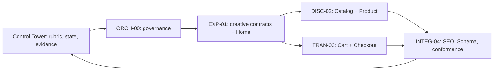
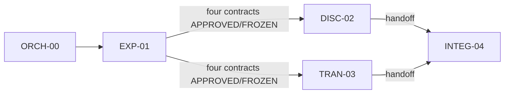
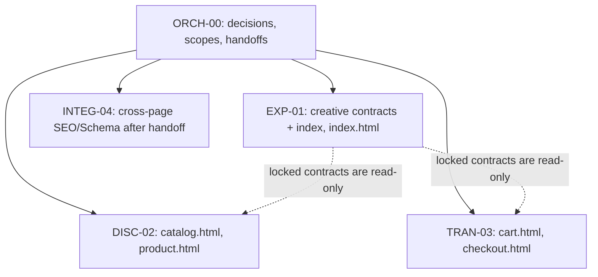

# Collaborative execution plan — 4g-006

This is a case-specific COLLABORATIVE_MODE_PILOT for the static five-view assignment. The Control Tower assignment manifest and rubric govern academic state. The [collaboration contract](COLLABORATION_CONTRACT.md), [contract index](CONTRACT_INDEX.yaml), [scope contracts](scopes/EXP-01.yaml), and [work packages](work-packages/EXP-01.md) govern this repository's handoffs.

## Current state

- Collaboration normalization: COMPLETE.
- EXP-01: COMPLETE.
- Home Golden Reference: APPROVED.
- Transversal contracts: FROZEN and released for downstream consumption.
- DISC-02 / TRAN-03: READY_FOR_ACTIVATION, pending real teammate identity/access binding and branch sync from current `main`.
- Ruth assigned to DISC-02; username `ruthcarol281076` supplied; access verification UNVERIFIED.
- Rodrigo assigned to TRAN-03; GitHub username/access PENDING.
- [Contributor assignments](CONTRIBUTOR_ASSIGNMENTS.yaml) and [onboarding files](onboarding/00_EMPIEZA_AQUI_RUTH_Y_RODRIGO.md) are available.
- INTEG-04: PARKED until both contributor handoffs are accepted.

## Complete system architecture

## Dependency DAG

## Authority and write ownership

ORCH-00 decides any contract amendment. EXP-01 is the sole creative-contract publisher before lock. Frozen transversal contracts are immutable to workers; requests use [Deviation and Rescue Protocol](DEVIATION_RESCUE_PROTOCOL.md). INTEG-04's later cross-page HTML ownership is temporal and begins only after DISC-02 and TRAN-03 hand off; this prevents simultaneous writers.

## Sequence and gates

1. ORCH-00 confirms the real DISC-02 and TRAN-03 contributor identities/access and binds each work package.
2. Before feature implementation, each owned feature branch is updated from current `main` so it contains the approved Golden Reference and frozen collaboration contracts.
3. DISC-02 and TRAN-03 implement in parallel within their frozen contracts, raising deviations instead of mutating shared contracts.
4. Each contributor completes required viewport checks, PR evidence and knowledge handoff.
5. INTEG-04 starts only after both contributor handoffs are accepted, then reconciles SEO/Schema and cross-page conformance.
6. Baseline rubric evaluation/repair precedes any Excellence implementation. Final evidence remains revision-bound.

Each process has an explicit [scope YAML](scopes/EXP-01.yaml) and [human work package](work-packages/EXP-01.md). Replace EXP-01 in the link with the assigned process ID.
