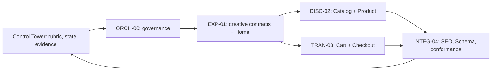
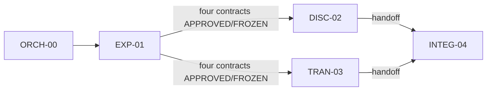
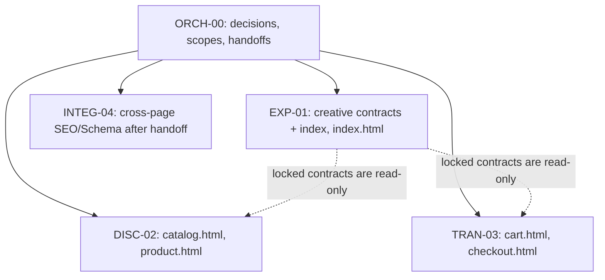

# Collaborative execution plan — 4g-006

This is a case-specific COLLABORATIVE_MODE_PILOT for the static five-view assignment. The Control Tower assignment manifest and rubric govern academic state. The [collaboration contract](COLLABORATION_CONTRACT.md), [contract index](CONTRACT_INDEX.yaml), [scope contracts](scopes/EXP-01.yaml), and [work packages](work-packages/EXP-01.md) govern this repository's handoffs.

## Complete system architecture

## Dependency DAG

## Authority and write ownership

ORCH-00 decides any contract amendment. EXP-01 is the sole creative-contract publisher before lock. Frozen transversal contracts are immutable to workers; requests use [Deviation and Rescue Protocol](DEVIATION_RESCUE_PROTOCOL.md). INTEG-04's later cross-page HTML ownership is temporal and begins only after DISC-02 and TRAN-03 hand off; this prevents simultaneous writers.

## Sequence and gates
1. ORCH-00 accepts the scaffold, binds real contributor identities, and opens EXP-01.
2. EXP-01 researches references, locks reference/visual/copy/product-content contracts and delivers the rendered Home golden reference. This normalization does none of that creative work.
3. DISC-02 and TRAN-03 implement in parallel only after all required transversal contracts are APPROVED/FROZEN. Each raises deviations rather than editing those contracts.
4. INTEG-04 starts only after both contributor handoffs, reconciles SEO/Schema and cross-page conformance, and returns evidence to ORCH-00.
5. Baseline rubric evaluation/repair precedes any [excellence proposal](EXCELLENCE_PROPOSAL.md). Final evidence is revision-bound.

Each process has an explicit [scope YAML](scopes/EXP-01.yaml) and [human work package](work-packages/EXP-01.md). Replace EXP-01 in the link with the assigned process ID.
